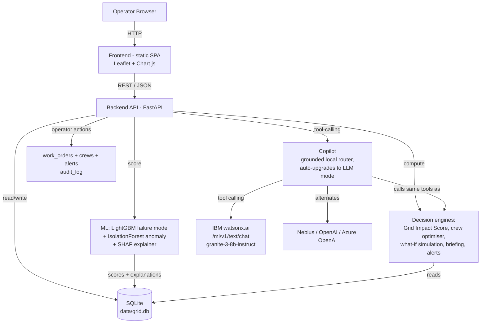

# Architecture

## System Architecture

## Components

| Component | Technology | Responsibility |
|---|---|---|
| Frontend | Static HTML/JS SPA styled with Tailwind CSS (CDN) plus a custom stylesheet, Leaflet for the map, Chart.js for sensor trends — served directly by FastAPI, no build step | Operator dashboard: overview, asset map, asset detail, maintenance queue, crew view, weather/outage view, what-if simulator, AI copilot chat |
| Backend API | FastAPI (`backend/main.py`) | All REST endpoints under `/api/*`, request validation (Pydantic), static file serving, SPA fallback routing |
| ML / AI | scikit-learn + LightGBM + SHAP (`backend/ml/`) | Feature engineering, failure-probability scoring, anomaly scoring, per-asset explainability |
| Decision engines | Plain Python services (`backend/services/`) | Grid Impact Score, area outage risk, ranked maintenance queue, crew pre-positioning optimiser, what-if simulation, auto-briefing, alert generation |
| Copilot | `backend/services/copilot.py` | Grounded, tool-calling operator Q&A — runs on IBM watsonx.ai's `/ml/v1/text/chat` tool-calling API (IAM-token auth, `ibm/granite-3-8b-instruct` by default), with Nebius/OpenAI/Azure as alternates and a deterministic grounded router as the no-key fallback |
| Operations | `backend/services/operations.py` | Operator actions — crew dispatch with skill/travel cost, work-order scheduling and deferral, crew pre-positioning, bulk emergency dispatch, alert acknowledgement, CSV exports and live system statistics |
| Data layer | SQLite via the Python stdlib `sqlite3` (`backend/db.py`) | Schema + data-access helpers for assets, sensor telemetry, weather, incidents, maintenance history, crews, predictions, area risk, alerts, **work orders**, and an audit log |
| Data generation / training pipeline | `backend/data/generator.py`, `scripts/seed.py` | Generates a correlated synthetic grid (latent asset health → sensors → failures), engineers features, trains and evaluates the models, and seeds the database end-to-end |

## Data Flow

1. `scripts/seed.py` generates 220 synthetic assets with a latent health
   value driven by age, load, maintenance history and weather stress, then
   simulates 21 days of hourly sensor telemetry and historical incidents
   from that latent health.
2. `backend/ml/features.py` builds 28 engineered features per asset (24h/72h
   rolling means, maxes and slopes, oil-quality degradation, asset age,
   maintenance recency, historical failure count, 24h weather forecast).
3. `backend/ml/model.py` trains a class-balanced LightGBM classifier
   (time-aware 75/25 split) plus an IsolationForest anomaly detector, and
   computes per-asset SHAP explanations; results are written into the
   `predictions` table together with `top_risk_factors` and a Grid Impact
   Score.
4. `backend/services/impact.py`, `maintenance.py`, `crew.py`,
   `simulation.py`, `briefing.py` and `alerts.py` read from that same
   SQLite database to compute area-level outage risk, the ranked
   maintenance queue, crew pre-positioning recommendations, what-if
   simulations, the operator briefing, and alerts.
5. `backend/main.py` exposes all of the above as REST/JSON under `/api/*`
   and serves the static frontend at `/`.
6. The Next.js frontend (`frontend-next/`) polls/fetches these endpoints to render
   the dashboard, map, charts, maintenance queue, crew view and simulator,
   and posts operator questions to `/api/copilot/query`.
7. The copilot answers either via IBM watsonx.ai function-calling (when
   `WATSONX_API_KEY` + `WATSONX_PROJECT_ID` are set) or a deterministic tool
   router (no API key needed). Both drive the exact same tool functions, and
   every answer returns the `evidence` (tool name, arguments, and result) it
   was built from, so nothing is invented.
8. Operator actions (`POST /api/work-orders/*`, `/api/crews/reposition`,
   `/api/dispatch/emergency`, `/api/alerts/{id}/ack`) write to `work_orders`,
   update `crews.availability` / `active_assignment`, flag `alerts`, and
   append to `audit_log` — which `GET /api/audit` reads back as the Runs Log.

## Security Considerations

- All request bodies are validated with Pydantic models (`SimulationRequest`,
  `CopilotRequest`) before touching the database or engines.
- Secrets (LLM API keys) are read only from environment variables via
  `backend/config.py` — nothing is hardcoded, and `.env` is git-ignored.
- Every recommendation, simulation and copilot query is written to an
  `audit_log` table for traceability.
- The copilot can **only** call a fixed allow-list of read/simulate tool
  functions (`copilot.TOOLS`) — it has no path to arbitrary code execution
  or arbitrary SQL, even in LLM mode.
- All data surfaced to the operator is explicitly labelled
  **SIMULATION DATA** (`config.IS_SIMULATION`) so it can never be mistaken
  for a live SCADA feed.

## Scalability Notes

The FastAPI backend is stateless per-request and could be horizontally
scaled behind a load balancer. The current SQLite data layer is a deliberate
demo-reliability trade-off (zero infrastructure, fully reproducible); the
codebase isolates all SQL access behind `backend/db.py`, so moving to
PostgreSQL is a contained change — replace the connection helper, swap `?`
placeholders for `%s` and `AUTOINCREMENT` for `SERIAL`, and everything above
`db.py` (services, ML, API routes) is unaffected. At real-world scale the
next bottlenecks would be the LightGBM scoring pass (batchable/schedulable
as an offline job rather than inline) and, if the LLM copilot mode is
enabled, the external LLM API call latency.
