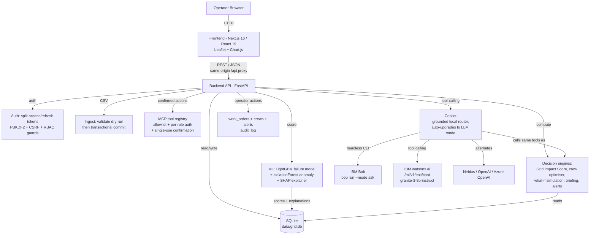

# Architecture

## System Architecture

## Components

| Component | Technology | Responsibility |
|---|---|---|
| Frontend | Next.js 16 (App Router, Turbopack), React 19, TypeScript, Tailwind v4 `@theme` tokens, IBM Plex type, TanStack Query, Leaflet for the map, Chart.js for sensor trends. `/api/*` is proxied same-origin, so there is no CORS in the browser path | Public landing page, login/signup, and the operator console: overview, asset map, asset detail, risk & areas, maintenance queue, crew view, what-if simulator, operator brief, data onboarding, and a copilot available on every page |
| Backend API | FastAPI (`backend/main.py`) | All REST endpoints under `/api/*`, request validation (Pydantic), role guards on every route, one error envelope, rate limiting on credential endpoints |
| Auth & RBAC | `backend/services/auth.py`, `backend/deps.py` | Split access/refresh tokens, PBKDF2 password hashing, HttpOnly cookies + CSRF double-submit, server-side revocation, three roles enforced per route — see [`security.md`](security.md) |
| Ingestion | `backend/services/ingest.py` | CSV onboarding for crews and assets: dry-run validation with per-row errors, then a single-transaction commit |
| MCP tool layer | `backend/services/mcp.py` | The AI's action surface: explicit tool allowlist, per-tool role checks, schema-validated arguments, single-use human confirmation for mutating tools, full audit |
| Resolution & risk | `backend/services/resolution.py`, `risk.py` | Completing a work order writes maintenance history, stamps the asset, releases the crew and re-derives risk through the real scoring pipeline |
| ML / AI | scikit-learn + LightGBM + SHAP (`backend/ml/`) | Feature engineering, failure-probability scoring, anomaly scoring, per-asset explainability |
| Decision engines | Plain Python services (`backend/services/`) | Grid Impact Score, area outage risk, ranked maintenance queue, crew pre-positioning optimiser, what-if simulation, auto-briefing, alert generation |
| Copilot | `backend/services/copilot.py` | Grounded, tool-calling operator Q&A. Provider order: **IBM Bob** headless CLI (`bob run --mode ask`, when `BOB_API_KEY` is set), then IBM watsonx.ai `/ml/v1/text/chat` (IAM-token auth, `ibm/granite-3-8b-instruct` by default), then Nebius/OpenAI/Azure, then a deterministic grounded router as the no-key fallback. Restricted to read-only tools |
| Operations | `backend/services/operations.py` | Operator actions — crew dispatch with skill/travel cost, work-order scheduling and deferral, crew pre-positioning, bulk emergency dispatch, alert acknowledgement, CSV exports and live system statistics |
| Data layer | SQLite via the Python stdlib `sqlite3` (`backend/db.py`) | Schema + data-access helpers for assets, sensor telemetry, weather, incidents, maintenance history, crews, predictions, area risk, alerts, **work orders**, and an audit log |
| Data generation / training pipeline | `backend/data/generator.py`, `scripts/seed.py` | Generates a correlated synthetic grid (latent asset health → sensors → failures), engineers features, trains and evaluates the models, and seeds the database end-to-end |

## Data Flow

1. `scripts/seed.py` generates 220 synthetic assets with a latent health
   value driven by age, load, maintenance history and weather stress, then
   simulates 21 days of hourly sensor telemetry and historical incidents
   from that latent health.
2. `backend/ml/features.py` builds 28 engineered features per asset (24h/72h
   rolling means, maxes and slopes, oil-quality degradation, asset age,
   maintenance recency, historical failure count, 24h weather forecast).
3. `backend/ml/model.py` trains a class-balanced LightGBM classifier
   (time-aware 75/25 split) plus an IsolationForest anomaly detector, and
   computes per-asset SHAP explanations; results are written into the
   `predictions` table together with `top_risk_factors` and a Grid Impact
   Score.
4. `backend/services/impact.py`, `maintenance.py`, `crew.py`,
   `simulation.py`, `briefing.py` and `alerts.py` read from that same
   SQLite database to compute area-level outage risk, the ranked
   maintenance queue, crew pre-positioning recommendations, what-if
   simulations, the operator briefing, and alerts.
5. `backend/main.py` exposes all of the above as REST/JSON under `/api/*`.
   Every route requires a role; `/api/public/stats` is the single exception,
   returning only aggregates for the public landing page.
6. The Next.js frontend (`frontend-next/`) polls/fetches these endpoints to render
   the dashboard, map, charts, maintenance queue, crew view and simulator,
   and posts operator questions to `/api/copilot/query`.
7. The copilot answers via IBM Bob, watsonx.ai function-calling, an
   OpenAI-compatible provider, or a deterministic tool router — whichever is
   configured, in that order, with no API key needed for the last. All of them
   drive the exact same tool functions, and every answer returns the `evidence`
   (tool name, arguments and result) it was built from, so nothing is invented.
   The copilot's tools are read-only; anything that writes must go through the
   MCP layer and a human confirmation.
8. Operator actions (`POST /api/work-orders/*`, `/api/crews/reposition`,
   `/api/dispatch/emergency`, `/api/alerts/{id}/ack`) write to `work_orders`,
   update `crews.availability` / `active_assignment`, flag `alerts`, and
   append to `audit_log` — which `GET /api/audit` reads back as the Runs Log.

## Security Considerations

- All request bodies are validated with Pydantic models (`SimulationRequest`,
  `CopilotRequest`) before touching the database or engines.
- Secrets (LLM API keys) are read only from environment variables via
  `backend/config.py` — nothing is hardcoded, and `.env` is git-ignored.
- Every recommendation, simulation and copilot query is written to an
  `audit_log` table for traceability.
- Authentication, RBAC, the MCP action surface, CSV upload handling and the
  risk-recalculation contract are documented in full in
  [`security.md`](security.md).
- The copilot can **only** call a fixed allow-list of read/simulate tool
  functions (`copilot.READ_ONLY_TOOLS`) — it has no path to arbitrary code
  execution or arbitrary SQL, even in LLM mode. Mutating actions require the
  MCP layer, a role check and a single-use human confirmation token.
- All data surfaced to the operator is explicitly labelled
  **SIMULATION DATA** (`config.IS_SIMULATION`) so it can never be mistaken
  for a live SCADA feed.

## Scalability Notes

The FastAPI backend is stateless per-request and could be horizontally
scaled behind a load balancer. The current SQLite data layer is a deliberate
demo-reliability trade-off (zero infrastructure, fully reproducible); the
codebase isolates all SQL access behind `backend/db.py`, so moving to
PostgreSQL is a contained change — replace the connection helper, swap `?`
placeholders for `%s` and `AUTOINCREMENT` for `SERIAL`, and everything above
`db.py` (services, ML, API routes) is unaffected. At real-world scale the
next bottlenecks would be the LightGBM scoring pass (batchable/schedulable
as an offline job rather than inline) and, if the LLM copilot mode is
enabled, the external LLM API call latency.
