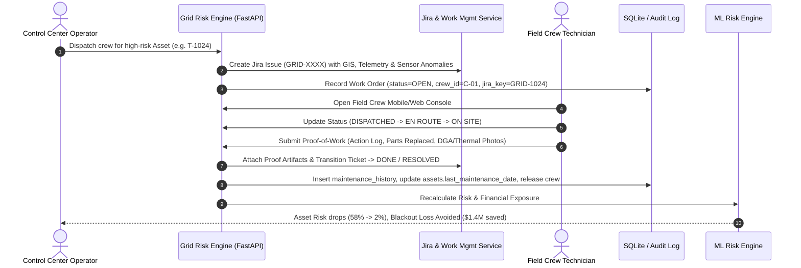

# Implementation Plan: Jira / Enterprise Work Management & Field Crew Proof-of-Work Integration

Bridge predictive AI grid alarms with real-world enterprise work execution (Jira / SAP PM / IBM Maximo) through automated ticket dispatching, digital proof-of-work field resolution (thermal scans, DGA oil logs, parts replacement), and closed-loop risk/financial recalculation.

---

## User Review Required

> [!IMPORTANT]
> **Enterprise Work Management Architecture**:
> - Integrates with Atlassian Jira REST API v3 / Webhooks while providing an in-memory/SQLite simulated fallback when external Jira credentials are not configured in `.env`.
> - Preserves 100% test isolation and zero third-party cloud runtime dependency out-of-the-box, but connects to real Jira Cloud instances with `JIRA_HOST`, `JIRA_EMAIL`, and `JIRA_API_TOKEN`.

---

## Architecture & Workflow Diagram



---

## Proposed Changes

### 1. Database & Schema Enhancements

#### [MODIFY] [`src/backend/db.py`](file:///c:/Users/hp/OneDrive/Desktop/a/bob-ai-hackathon-Nirmaan/src/backend/db.py)
- Enhance `work_orders` table with Jira tracking fields:
  - `jira_key TEXT` (e.g., `GRID-1024`)
  - `jira_url TEXT`
  - `field_status TEXT DEFAULT 'DISPATCHED'` (`DISPATCHED`, `EN_ROUTE`, `ON_SITE`, `RESOLVING`, `COMPLETED`)
  - `proof_attachments TEXT` (JSON array of evidence URLs/metadata: thermal scans, DGA oil tests, dielectric breakdown certificates)
  - `technician_signature TEXT`
  - `completed_at TEXT`
- Add migration hook in `init_db()` to automatically alter existing tables without breaking data.

---

### 2. Jira & Work Management Backend Service

#### [NEW] [`src/backend/services/jira.py`](file:///c:/Users/hp/OneDrive/Desktop/a/bob-ai-hackathon-Nirmaan/src/backend/services/jira.py)
- **Ticket Lifecycle Management**:
  - `create_jira_ticket(asset_id, crew_id, priority, risk_summary)`: Constructs structured Jira issues with Markdown description, telemetry metrics (temp, vibration, oil quality), GIS impact score, and target SLA.
  - `sync_jira_status(jira_key, target_status, resolution_notes)`: Transitions Jira workflow states (`To Do` $\to$ `In Progress` $\to$ `Under Review` $\to$ `Done`).
  - `attach_proof_of_work(jira_key, files, metadata)`: Stores uploaded evidence files locally in `src/data/proof_of_work/` and links them to the Jira ticket.
  - `get_jira_config()` / `test_jira_connection()`: Checks connectivity to Atlassian Jira Cloud or defaults to Simulated Enterprise Mode.

#### [MODIFY] [`src/backend/services/resolution.py`](file:///c:/Users/hp/OneDrive/Desktop/a/bob-ai-hackathon-Nirmaan/src/backend/services/resolution.py)
- Update `complete_work_order` to accept `proof_attachments`, `field_status`, `technician_badge`, and `parts_replaced`.
- Call `jira.sync_jira_status()` inside the resolution transaction.
- Return comprehensive audit payload including Jira resolution status, before/after failure probability ($P(\text{fail})$), and financial loss avoided ($).

#### [MODIFY] [`src/backend/services/operations.py`](file:///c:/Users/hp/OneDrive/Desktop/a/bob-ai-hackathon-Nirmaan/src/backend/services/operations.py)
- When `dispatch_crew` or `schedule_maintenance` is executed, automatically invoke `jira.create_jira_ticket()` and attach the generated `jira_key` to the work order.

#### [MODIFY] [`src/backend/main.py`](file:///c:/Users/hp/OneDrive/Desktop/a/bob-ai-hackathon-Nirmaan/src/backend/main.py)
- Register Jira & Proof-of-Work REST endpoints:
  - `GET /api/jira/status`: Health check / Jira integration connection state.
  - `GET /api/jira/tickets`: List synced enterprise tickets.
  - `POST /api/work-orders/{wo_id}/proof`: Upload proof-of-work images/PDFs (thermal IR scan, DGA test sheet).
  - `POST /api/work-orders/{wo_id}/status`: Update field technician status (`EN_ROUTE`, `ON_SITE`).
  - `POST /api/work-orders/{wo_id}/resolve`: Complete repair with full proof-of-work payload.
  - Static file mount: `/api/proof-files/{filename}` to serve uploaded proof artifacts.

---

### 3. Frontend Next.js / Carbon UI Integration

#### [NEW] [`src/frontend-next/components/crews/ProofOfWorkModal.tsx`](file:///c:/Users/hp/OneDrive/Desktop/a/bob-ai-hackathon-Nirmaan/src/frontend-next/components/crews/ProofOfWorkModal.tsx)
- Interactive Field Technician Proof-of-Work Modal & Drawer:
  - **Status Stepper**: Visual progression from `Dispatched` $\to$ `En Route` $\to$ `On Site` $\to$ `Resolution`.
  - **Evidence Dropzone**: Upload thermal imaging scans, oil test reports, or select pre-configured simulated field test templates (e.g. *Thermal IR scan of bushing hot-spot*, *Transformer Oil DGA report*, *Contact Resistance Test*).
  - **Resolution Details**: Action taken text area, multi-select / tag input for parts replaced (`Bushing 500kV`, `Oil Filter Cartridge`, `Gasket Set`), and technician digital sign-off.
  - **Live Impact Feedback**: Visual preview showing before-and-after failure probability and dollar risk mitigation upon submission.

#### [MODIFY] [`src/frontend-next/app/crews/page.tsx`](file:///c:/Users/hp/OneDrive/Desktop/a/bob-ai-hackathon-Nirmaan/src/frontend-next/app/crews/page.tsx)
- Add **"Field Proof-of-Work"** button next to active crew jobs.
- Display synced **Jira Ticket Badges** (e.g., `[Jira: GRID-1024]` with direct link / status popover).
- Add Quick Proof-of-Work resolution flow directly from the active crew roster table.

#### [MODIFY] [`src/frontend-next/app/maintenance/page.tsx`](file:///c:/Users/hp/OneDrive/Desktop/a/bob-ai-hackathon-Nirmaan/src/frontend-next/app/maintenance/page.tsx)
- Show enterprise ticket references for queued & dispatched work orders.
- Provide direct link to open proof-of-work drawer for in-progress work orders.

#### [MODIFY] [`src/frontend-next/lib/api.ts`](file:///c:/Users/hp/OneDrive/Desktop/a/bob-ai-hackathon-Nirmaan/src/frontend-next/lib/api.ts)
- Add TypeScript types and client API methods:
  - `API.jiraStatus()`
  - `API.jiraTickets()`
  - `API.uploadProof(woId, formData)`
  - `API.updateWorkOrderStatus(woId, status)`
  - `API.resolveWorkOrderWithProof(woId, payload)`

---

### 4. Automated Test Suite

#### [NEW] [`src/backend/tests/test_jira_proof_of_work.py`](file:///c:/Users/hp/OneDrive/Desktop/a/bob-ai-hackathon-Nirmaan/src/backend/tests/test_jira_proof_of_work.py)
- Validate end-to-end flow:
  1. Dispatch crew $\to$ verifies Jira ticket `GRID-XXXX` creation.
  2. Transition field status to `EN_ROUTE` and `ON_SITE`.
  3. Upload simulated proof-of-work thermal artifact.
  4. Submit resolution with parts replaced and technician signature.
  5. Assert crew is freed (`AVAILABLE`), asset `last_maintenance_date` is updated, Jira ticket transitions to `DONE`, and asset risk decreases.

---

## Verification Plan

### Automated Tests
- Run full pytest test suite:
  ```powershell
  cd src
  python -m pytest backend/tests/test_jira_proof_of_work.py backend/tests/test_resolution.py backend/tests/test_financials.py -v
  ```

### Manual Verification
1. Open the UI at `http://localhost:3000/crews` and `http://localhost:3000/maintenance`.
2. Dispatch a crew to critical asset `T-1024`.
3. Verify that a Jira issue `GRID-XXXX` is created with telemetry metadata.
4. Click **"Submit Proof-of-Work"** on Crew `C-01`.
5. Select sample thermal scan evidence, log "Bushing replacement & oil degasification", and click **"Complete & Verify"**.
6. Verify instant risk drop ($58\% \to 2\%$) and crew status update to `AVAILABLE`.
